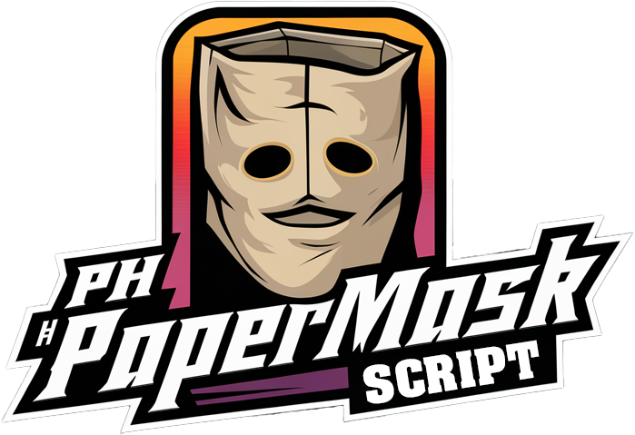

  
ph_papermask (https://github.com/PhilVon/ph_papermask)
-----------------
Preview:  

Overview
-----------------
ph_papermask is a FiveM resource that allows players to convert paperbag's to player masks and wear them.

Features
-----------------
- Convert a paperbag into a mask
- Allows players to wear paper masks
- Supports all papermasks in GTA5
- Implements OX_inventory to allow for conversion and wearing of mask

Requirements
-----------------
- ox_inventory (https://github.com/overextended/ox_inventory)

- [recommended] Clothes as item - 24k Drawn icons OF MP ped (https://forum.cfx.re/t/clothes-as-item-24k-drawn-icons-of-mp-ped/5183496)
    Or any other icons for the paper masks as none are provided

Installation
-----------------
- Download the latest version of ph_papermask
- Place the ph_papermask directory in your resources directory
- Add ensure ph_papermask to your server.cfg file
- Add your chosen mask icon images to ox_inventory/web/images/ named as papermask#.png and to ph_papermask/web/images/ named as #.png (# is the texture id for the mask variation)
- Add the items from INSTALL/items.lua to your ox_inventory/data/items.lua file

Configuration
-----------------
No Config file implemented yet, but you can change the code to suit your needs.
To implement notifications just replace the print() in code with calls to your notification system.

Usage
-----------------
- in your inventory screen right click a paper bag and select 'modify' to open the convert mask UI
- In inventory use a mask to wear it, use again to remove the mask

Roadmap
-----------------
- add config file
- add animations
- implement requirement for a marker pen in inventory to convert mask
- add a default notification system for messages to player
